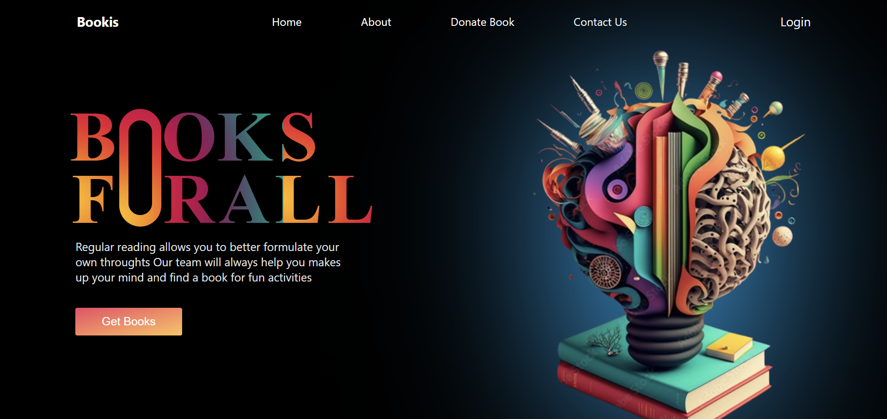
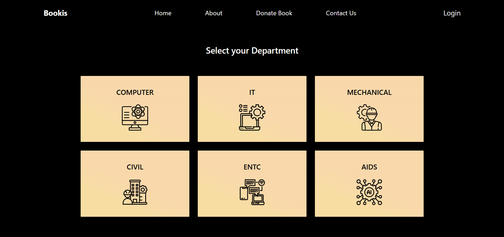
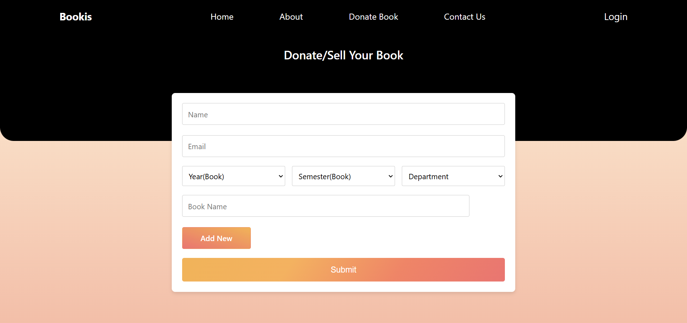
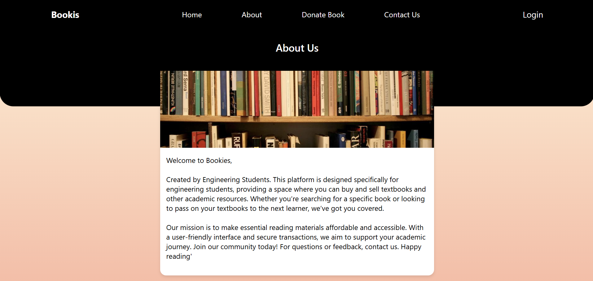
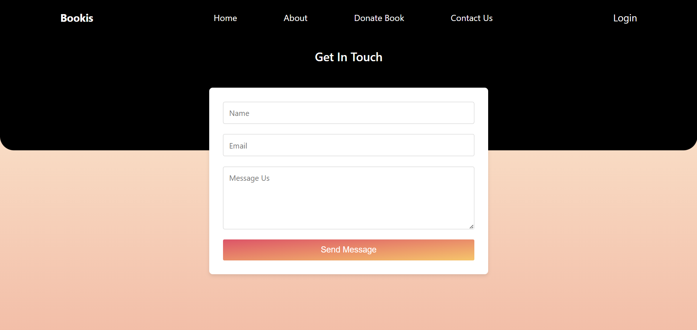

# 📚 **Bookies** - Your Academic Companion

Welcome to **Bookies**, a platform built by engineering students for engineering students! Whether you're looking for a textbook, selling your old ones, or simply sharing knowledge, we've designed this platform to make academic resources **affordable**, **accessible**, and **collaborative**.

---

## 🌟 **Features**

1. **Buy and Sell Books**  
   Effortlessly find or list textbooks and academic resources for every engineering department.

2. **User-Friendly Interface**  
   Navigate seamlessly with our clean and intuitive design.

3. **Department-Specific Resources**  
   Tailored sections for **Computer**, **IT**, **Mechanical**, **Civil**, **ENTC**, and **AIDS** to quickly find what you need.

4. **Donate or Request Books**  
   Share your resources or request the ones you need with a few simple clicks.

5. **Secure and Reliable**  
   Trusted transactions and data security ensure peace of mind.

---

## 🖼️ **Project Preview**

### 🔷 **Home Page**  
> Welcome to our vibrant home screen that showcases our mission: making learning accessible to everyone!  

### 🔷 **Select Department**  
> Browse resources specific to your engineering department.  

### 🔷 **Donate/Sell Books**  
> Share your knowledge or sell unused resources through our easy-to-use form.  

### 🔷 **About Us**  
> Empowering Engineering Minds, One Book at a Time!

### 🔷 **Contact Us**  
> "We're Here to Help!"

---

### 🚀 Technologies Used in **Bookies**  

- **Frontend**: 🖥️ **React** – Dynamic, responsive, and component-based UI.  
- **Backend**: 🌐 **Node.js** – Fast, scalable server management.  
- **Database**: 🗄️ **MongoDB** – Secure and flexible data storage.  

Together, these technologies power **Bookies** to deliver a fast, secure, and user-friendly platform! 📚✨  

---

## 🚀 **Getting Started**

Follow these steps to explore and use Bookies:

1. **Visit the Homepage**  
   Explore our mission and start browsing resources with the "Get Books" button.

2. **Select Your Department**  
   Navigate to your department-specific page for tailored resources.

3. **Buy, Sell, or Donate**  
   Use our forms to donate, request, or sell books securely.

---

## ❤️ **Join Us Today!**  
Be part of a community that values **knowledge-sharing** and **learning without limits**. Happy reading!  

